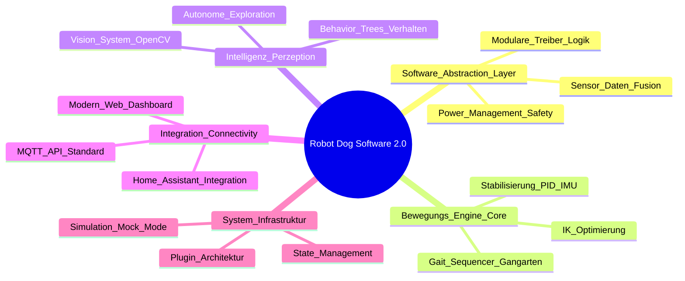

# Software-Entwicklungs-Roadmap & Mindmap

Dies ist die Planungsebene für die komplette **softwareseitige Neuentwicklung** des Roboters. Die vorhandene Hardware bleibt unverändert, wird aber durch eine neue Software-Architektur effizienter und intelligenter genutzt.

## Erläuterung der Software-Säulen

### 1. Software Abstraction Layer (SAL)
*   **Ziel:** Saubere Trennung zwischen Hardware-Ansteuerung und der Logik. [Erledigt: Detailplanung vorhanden]

### 2. Bewegungs-Engine (The Brain of Movement)
*   **Ziel:** Hochpräzise und flüssige Steuerung der 12 Gelenke.
*   **Fokus:** Mathematische Neu-Implementierung der Inversen Kinematik (IK) und flüssige Bewegungsabläufe. [In Bearbeitung: Detailplanung vorhanden]

*   **Ziel:** Vom ferngesteuerten Spielzeug zum autonomen Agenten.
*   **Status:** [Abgeschlossen] YuNet/SFace Integration, Trust-System, Multi-View Memory, Gestensteuerung.
*   **Fokus:** Einbindung von Behavior Trees (Verhaltensbäumen) für komplexe Abläufe.

### 4. Integration & Connectivity (Home Assistant Focus)
*   **Ziel:** Nahtlose Einbindung in das Smart Home & moderne Steuerung.
*   **Fokus:** 
    *   **MQTT-Interface:** Datenbereitstellung und Befehlsempfang via MQTT (Auto-Discovery für Home Assistant).
    *   **Dashboard:** Ein modernes Web-Interface für direkte Browser-Kontrolle (Handy/Tablet/PC).
    *   **Automatisierung:** Steuerung des Hundes über HA-Automationen (z.B. "Wachhund bei Abwesenheit").

### 5. System-Infrastruktur
*   **Ziel:** Erweiterbarkeit durch Plugin-Architektur und Unterstützung eines Simulations-Modus für PC-Tests.

---
*Status: Roadmap um Home Assistant Integration und API-Fokus erweitert.*
